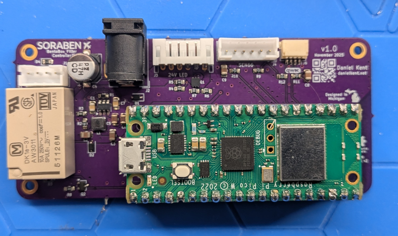
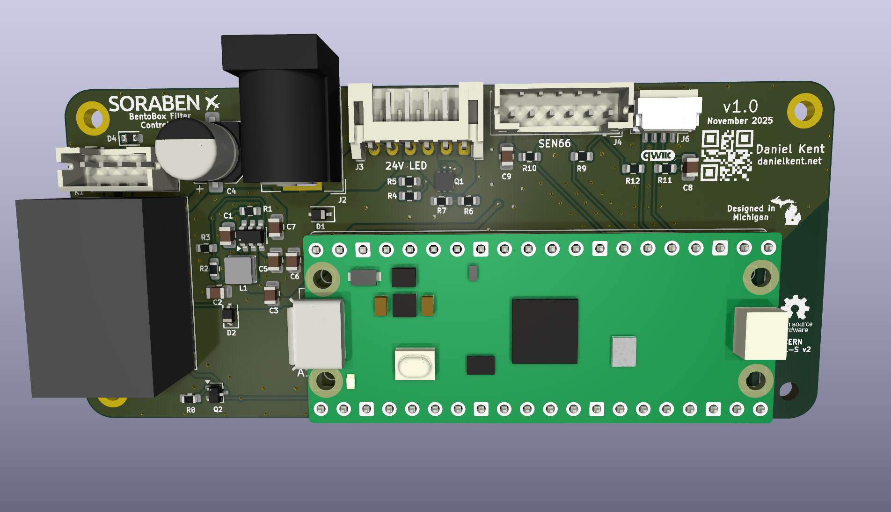

# Soraben - 3D Printer BentoBox Filter Companion

Soraben is a project designed to allow automation of a 3D printer filter such
as the [BentoBox](https://www.printables.com/model/272525) using an
RP2040-based Raspberry Pi Pico (W) microcontroller, while also enabling
enclosure air quality monitoring using a connected SEN6x air quality sensor.
Soraben also has optional connectors for dual-color LED strips, and a JST-SH
Qwiic-compatible connector for attaching additional sensors.
Soraben is powered using a single 24VDC input. More information on Soraben
can be found [on my website](https://danielkent.net/projects/posts/20260328-soraben.html).

This repository contains the KiCad design files, bill of materials, and 3D
printable enclosure for Soraben. 

# Making Your Own

I had my bare Soraben PCBs fabricated at [OSH Park](https://oshpark.com/). To
order at OSH Park, upload `pcb/soraben.kicad_pcb` to the OSH Park website and
follow their instructions.

For any other PCB fab, download the project files and use KiCad to generate
the Gerber files required for fabrication. You will need to add the project
symbols and footprints (both custom and the ki-lime-pi-to-go libraries)
to your project files.

I strongly suggest ordering a solder stencil and using a PCB reflow oven to
assemble the board. You can hand solder the through-hole components afterwards.

# License
The KiCad project files are licensed under the CERN OHL-S V2 license. You are
free to share and remix this design provided you abide by the terms of the
license, which may require you to share your design files and provide
attribution to me.

The 3D printable 3MF files are dual licensed under the CERN OHL-S V2 license
and the Creative Commons 4.0 Attribution-ShareAlike license.

The [ki-lime-pi-to-go library](https://github.com/recursivenomad/ki-lime-pi-to-go)
for Raspberry Pi Pico footprints is available from the original author under
the MIT-0 license.

